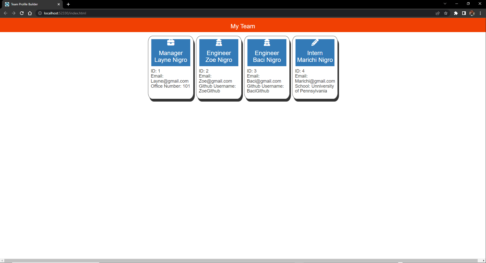

# Team-Profile-Generator

## Description

This project was designed to dynamically create an HTML page for a team of employees by inputting information into various prompts. This application features a smooth and streamlined process for creating a team roster page to maximize efficiency, a user can quickly make the page with no prior knowledge of web development. In the process of creating this project I learned a lot about using classes in node.js as well as running tests and I improved my knowledge of using node.js to dynamically create a webpage.

## Installation

Run commands: "npm install Inquirer^@8" "npm install jest^@29"

## Usage

Run command: "node index.js" to initiate application

 Demo Video:
    https://drive.google.com/file/d/1Rj59TGVcLgemtH40CkBHlVdJ5C8-xO8k/view?usp=share_link
 
 Demo Screenshot:
    

## Tests
To run tests use the command:
npm run test
